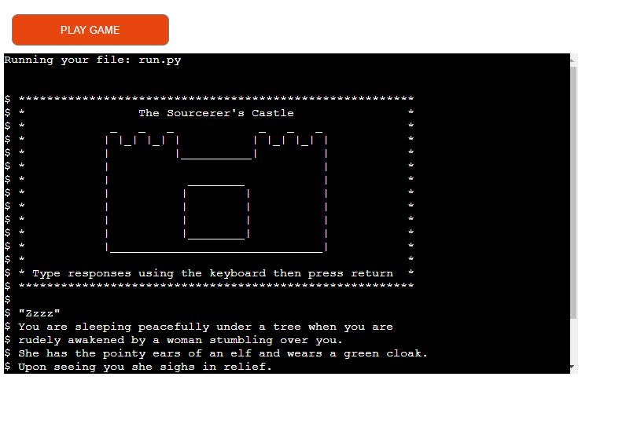
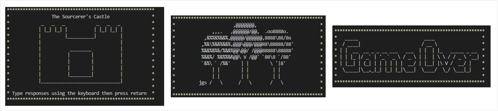
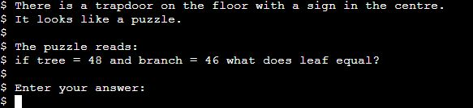
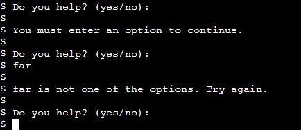
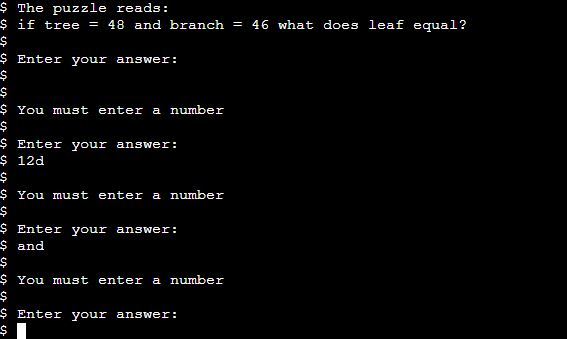

# The Sourcerer's Castle

The Sourcerer's Castle is a text based story and puzzle game which runs in the Code Institute mock terminal on Heroku. Players are sent on a quest to the Sorcerer's Castle to find an antidote for the poisoned Tree of Life thus saving the Forest of High Elms.

[The live project can be found here.](https://sorcerers-castle.herokuapp.com/)

## How to Play

Text descriptions lead the player through the game. At various points they will be asked to provide their input. This input will either be a solution to a word or number puzzle or a choice of options (such as left or right). The input the user provides will determine the next destination of the game. Some options or incorrect answers will lead to game over. At certain points of the game the player will also be asked to choose an item to add to their inventory.

The player wins when they correctly navigate through the story to the final 'antidote' room and also have the correct items in their inventory.

A flow chart of the different game routes can be viewed [here.](assets/screenshots/sourcerers-castle-flow-chart.pdf)

## Features

* ### Graphics
    * Simple graphics for the introductory message, game over message and win game message break up the text and make the came more visually interesting.

* ### Puzzles
   * Asking the player to solve puzzles at certain points in the game makes it a bit more interesting and challenging than a standard text based story game.

* ### Input Validation and Error Checking
    * Checks are in place for the story options to ensure the player only inputs one of the available choices.
    * Messages are displayed to inform the player of an incorrect input.
    * The player puzzle responses are also checked you ensure that they have given the right type of input without giving away the puzzle answer.

## Data Model

To keep the functions that control the flow of the game relatively simple and reusable, the information from the various branches of the story, including text, options and exit routes has been stored in instances of a 'Branches' class.

PuzzleStrings and EndRoomStrings classes have also been created to store most of the string text used in the puzzles and end room.

## Testing

* Continuous testing was carried out throughout the development process with errors corrected as they appeared.
* The Gitpod in built problem reporting also helped to identify problems when they arose.
* The way the return routes of the story were originally set up caused recursion errors so the route option was changed to a string rather than function call and extra elif statements were added to the choose_destination function.
* The 'exit type' key for a number of the 'Branches' instances was also erroneously not formated as a string causing the program to fail. All the instances of this problem were corrected.
* Every possible route of the game has been run through to ensure that there are no errors.

### Unfixed Bugs
* The printing function is supposed to print the text one character at a time giving the impression of a story being typed. It works well in Gitpod, but the sys.stdout.flush does not appear to work when running using the terminal template on Heroku.
* The time.sleep does still work though and determines and slows the speed of the print messages improving the story flow.

### Validator Testing
* No errors are reported when passing through the [PEP8 online check.](http://pep8online.com/)

## Deployment

### Heroku

The project was deployed using the Code Institute mock terminal for Heroku. The following steps can be used to deploy the site:
* Navigate to GitHub locate and fork or clone the GitHub repository.
* Navigate to and login to Heroku.
* From the dashboard select 'New' and 'Create new app'.
* Give the app a name (the name must be unique) and click 'Create app'.
* Navigate to the settings tab and select 'Add buildpack'.
* Search for and select the 'Python' and 'NodeJS buildpacks in that order.
* Navigate to the 'Deploy' tab and choose GitHub as the deployment method.
* Search for and select the correct GitHub repository.
* Select either automatic of manual deployment.

### Forking the GitHub Repository

The following steps can be used to fork the GitHub repository:
* On GitHub navigate to the main page of the repository.
* The 'Fork' button can be found on the top righthand side of the screen.
* Click the button to create a copy of the original repository.

### Cloning the GitHub Repository

The following steps can be used to clone the GitHub repository:
* On GitHub navigate to the main page of the repository.
* Above the list of files select 'Code'.
* Three options are provided, HTTPS, SSH and GitHub CLI. Select the appropriate option and click the 'Copy' button next to the URL.
* Open Git Bash.
* Change the working directory to the location for the cloned directory.
* Type git clone and paste the copied URL.
* Press 'Enter' to create the clone.

## Credits

* Code Institute provided the template for the deployment terminal.
* The code for seting the speed of the print messages was taken from [Stack Overflow.](https://stackoverflow.com/questions/4627033/printing-a-string-with-a-little-delay-between-the-chars) The idea to create a separate function for this came from Ruairidh MacArthur's [Escape the Cave.](https://github.com/roomacarthur/escape-the-cave)
* Help for the ascii graphic messages was found at [ascii.co.uk](https://patorjk.com/software/taag/#p=display&f=Big&t=Game%20Over) and [patorjk.com.](https://ascii.co.uk/)